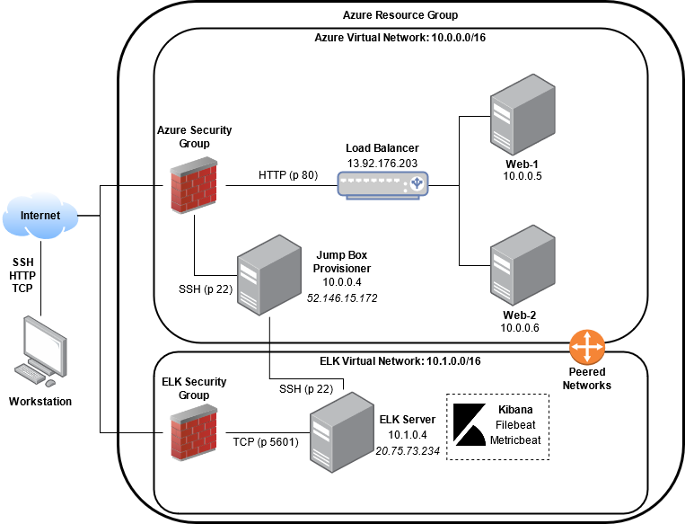
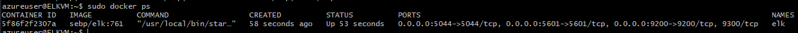
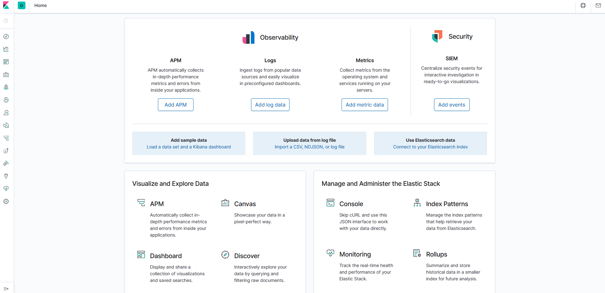

## Automated ELK Stack Deployment

The files in this repository were used to configure the network depicted below.

These files have been tested and used to generate a live ELK deployment on Azure. They can be used to either recreate the entire deployment pictured above. Alternatively, select portions of the `ansible` file may be used to install only certain pieces of it, such as Filebeat.

  - /etc/ansible

This document contains the following details:
- Description of the Topology
- Access Policies
- ELK Configuration
  - Beats in Use
  - Machines Being Monitored
- How to Use the Ansible Build

### Description of the Topology

The main purpose of this network is to expose a load-balanced and monitored instance of DVWA, the D*mn Vulnerable Web Application.

Load balancing ensures that the application will be highly redundant, in addition to restricting access to the network.
- Load balancers protect availability by keeping applications from going down via excess web traffic, and it protects against DDoS attacks by sending traffic across multiple servers.
- Jump boxes help with network configuration, administration of access control for other users on the network, and automating application deployment.

Integrating an ELK server allows users to easily monitor the vulnerable VMs for changes to the log files and system metrics.
- Filebeat watches for specific log files and collects those events in order to forward them to Elasticsearch and Logstash for indexing.
- Metricbeat records statistical data from the operating systems and services that are running on monitored servers.

The configuration details of each machine may be found below.

| Name                 | Function   | IP Address | Operating System |
|----------------------|------------|------------|------------------|
| Jump-Box-Provisioner | Gateway    | 10.0.0.4   | Linux            |
| ELKVM                | ELK Server | 10.1.0.4   | Linux            |
| Web-1                | Web Server | 10.0.0.5   | Linux            |
| Web-2                | Web Server | 10.0.0.6   | Linux            |

### Access Policies

The machines on the internal network are not exposed to the public Internet. 

Only the ELKVM machine can accept connections from the Internet. Access to this machine is only allowed from the following IP addresses:
- Workstation public IP address
- Jump Box Provisioner: 10.0.0.4

Machines within the network can only be accessed by connecting to the instance's load balancer via its public IP address.
- The Jump Box Provisioner machine was allowed to access the ELK VM and its private IP address was 10.0.0.4.

A summary of the access policies in place can be found in the table below.

| Name                 | Publicly Accessible | Allowed IP Addresses           |
|----------------------|---------------------|--------------------------------|
| Jump-Box-Provisioner | Yes/No              | 10.0.0.5 10.0.0.6              |
| Web-1                | No                  | 10.0.0.4                       |
| Web-2                | No                  | 10.0.0.4                       |
| ELKVM                | Yes                 | 10.0.0.4 Workstation Public IP |
| redteamLB            | Yes                 | Workstation Public IP          |

### Elk Configuration

Ansible was used to automate configuration of the ELK machine. No configuration was performed manually, which is advantageous because...
- The main advantage of automating configuration with Ansible is that you can deploy multiple servers using a single playbook which ensures that they are all provisioned and configured identically as quickly and easily as possible. 

The playbook implements the following tasks:
- Install docker.io, python3-pip, and the Docker module
- Increase the container's virtual memory
- Download and launch Docker ELK container image with open ports 5601, 9200, and 5044
- Enable the docker service on boot

The following screenshot displays the result of running `docker ps` after successfully configuring the ELK instance.

### Target Machines & Beats
This ELK server is configured to monitor the following machines:
- Web-1: 10.0.0.5
- Web-2: 10.0.0.6

We have installed the following Beats on these machines:
- Filebeat
- Metricbeat

These Beats allow us to collect the following information from each machine:
- 'Filebeat' collects log files and events, for example it could store apache web server logs, system logs, etc.
- 'Metricbeat' collects statistical data on operating systems and services such as CPU usage, memory usage, etc.

### Using the Playbook
In order to use the playbook, you will need to have an Ansible control node already configured. Assuming you have such a control node provisioned: 

SSH into the control node and follow the steps below:
- Copy the install_elk.yml playbook file to /etc/ansible.
- Update the /etc/ansible/hosts file to include the IP addresses of the web servers under the [webservers] section as well as the IP address of the ELK server under the [elk] section.
- Run the playbook, and navigate to http://[your.ELK.VM.IP]:5601/app/kibana to check that the installation worked as expected.

